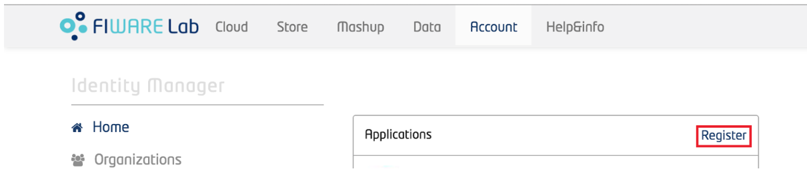
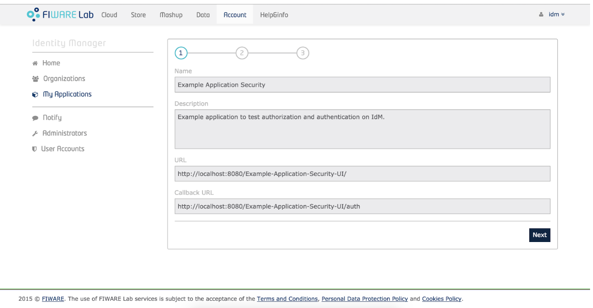
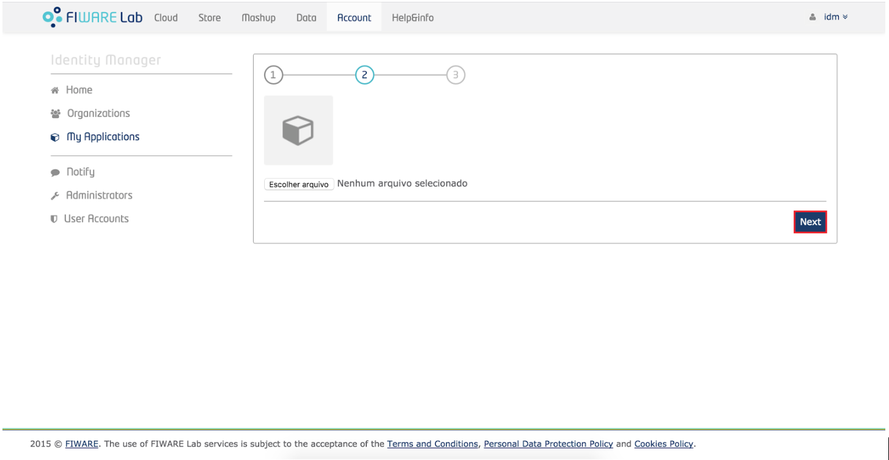
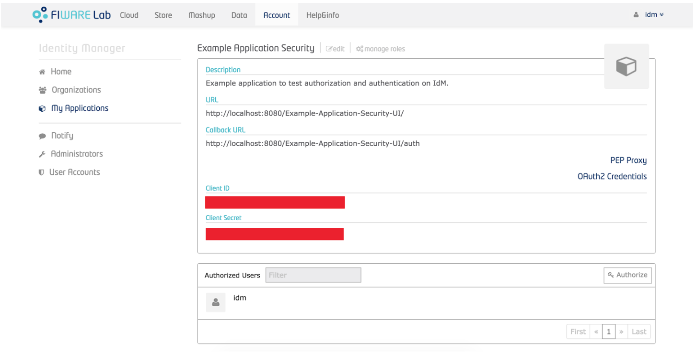

Guia de Criação
===============

- Para prosseguir com esse tutorial é necessário ter executado todos os tutoriais anteriores (guia de execução, instalação e configuração), acessar o endereço do <IP-Máquina>:8000 e acessar a interface do keyrock. Para acessar a interface de administrador acesse com usuário: idm e senha: idm. 
- Caso queira criar um usuário novo, basta clicar no botão de criar novo usuário na página inicial e seguir as instruções.
- Caso tenha optado por entrar na conta de administrador e cadastrar aplicações basta seguir as instruções abaixo: 
- Para registrar uma aplicação clique no botão "register" como mostra a figura abaixo: 

- Então siga os três passos para concluir o registro, inicialmente cadastre o nome da aplicação, sua descrição, a url da aplicação e a url de redirecionamento onde o token de usuário será enviado.

- Aperte em "next" e escolha uma imagem para a aplicação, essa imagem é opcional

- Por fim, identifique a política de acesso para a sua aplicação, você poderá criar novas permissões e papéis através dessa interface.
.. image:: imagens/developer-portal.png    
- Após o término da configuração teremos essa página:

Onde as informações de client secret serão usuadas na sua aplicação. Na mesma página gere um PEP-Proxy, e use suas credenciais na sua aplicação também, essas informações devem ser editadas no guia de configuração.
